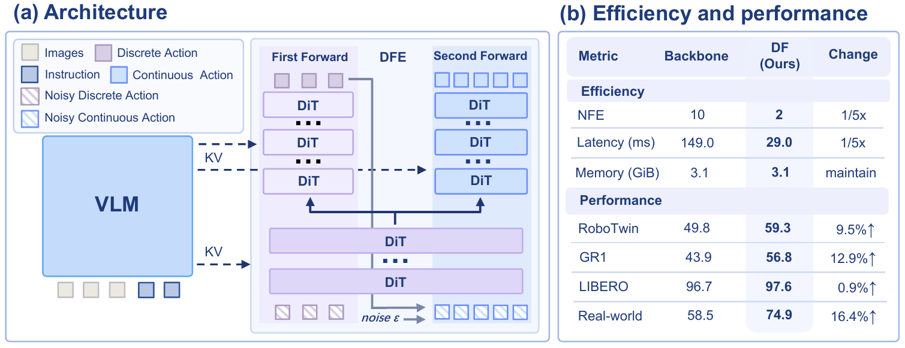

# Discrete Forcing

<p align="center">
  <a href="https://arxiv.org/abs/2609.39526"></a>
  <a href="https://discrete-forcing.github.io/index.html"></a>
  <a href="https://github.com/Jbo-Wang/discrete_forcing"></a>
</p>

Code for training and evaluating a discrete-to-continuous vision-language-action
policy. 

## News

- **2026-09-30:** [Discrete Forcing](https://arxiv.org/abs/2609.39526) is available on arXiv.

## Overview



The policy predicts discrete action tokens and refines the resulting action
sequence with a continuous branch. The two branches use separate action tokens
and share the vision-language backbone. 

## Getting Started

Follow the [LIBERO guide](docs/LIBERO.md) or the
[RoboTwin guide](docs/RoboTwin.md).

## TODO

- [x] Release LIBERO training and evaluation code.
- [x] Add RoboTwin clean 50 training and evaluation code.

## Citation

```bibtex
@article{wang2026discrete,
  title={Discrete Forcing: Infusing Discrete Guidance into Continuous Denoising for Few-Step Action Experts},
  author={Wang, Jingbo and others},
  journal={arXiv preprint arXiv:2609.39526},
  year={2026}
}
```

## Acknowledgments

This implementation builds on [StarVLA](https://github.com/starVLA/starVLA).
We thank its authors and contributors for releasing the codebase.
